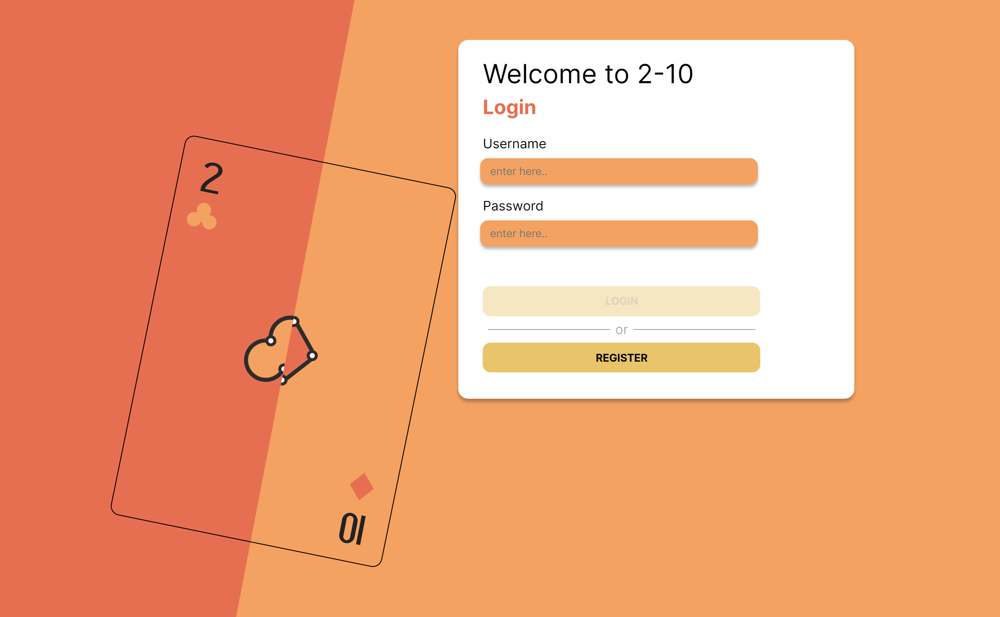
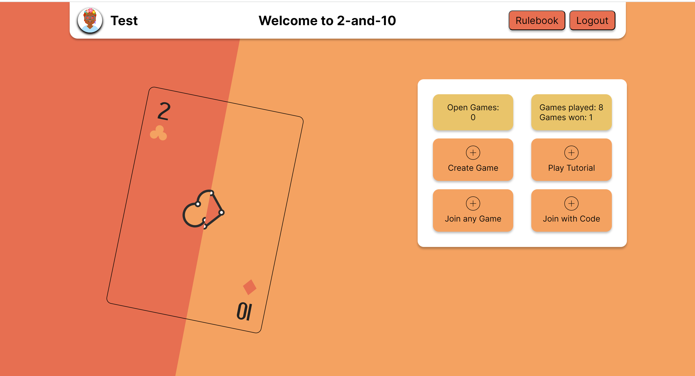
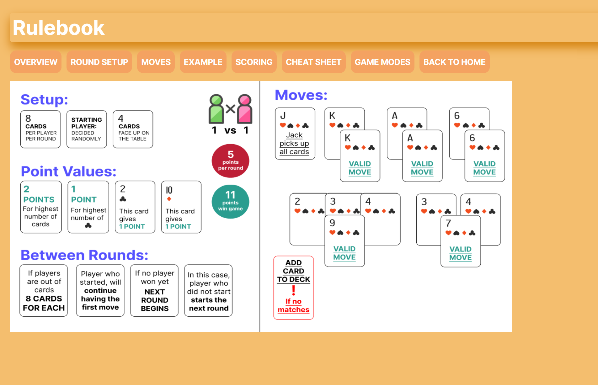
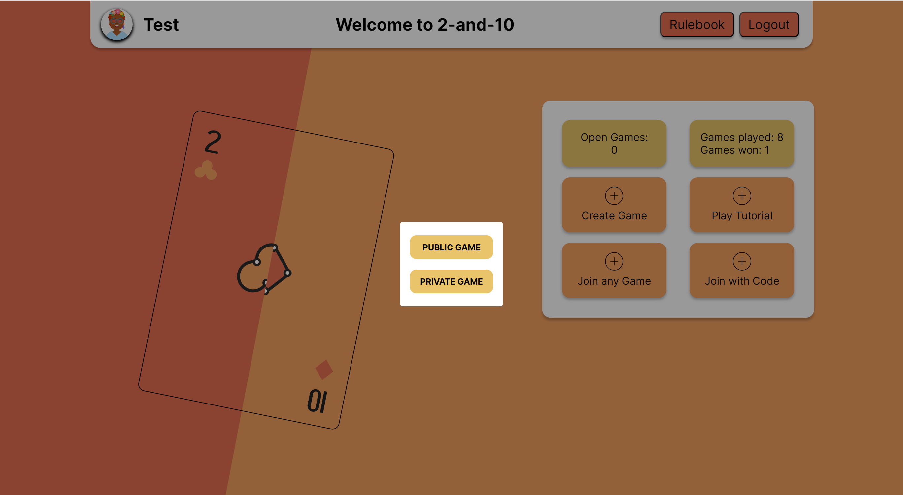
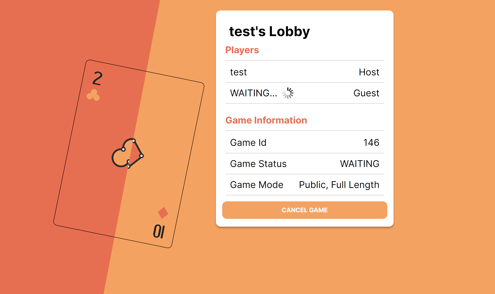
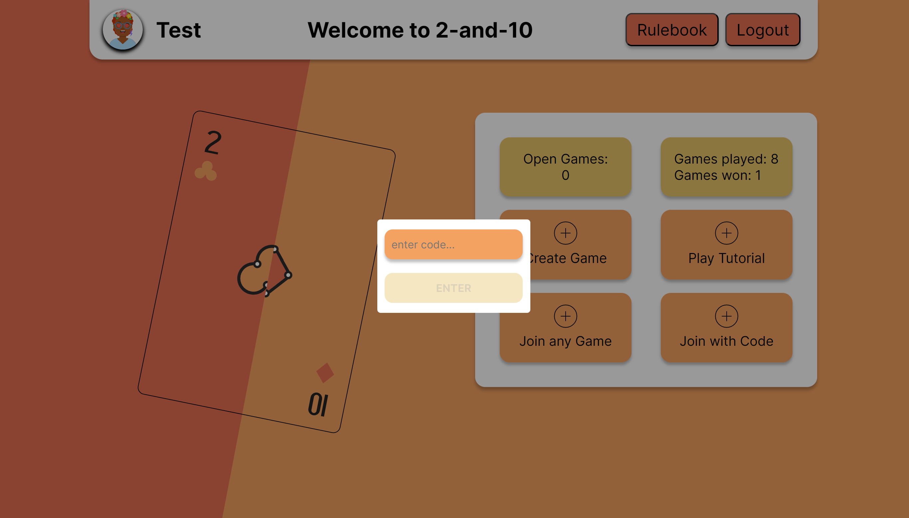

# SoPra Group 37

### Introduction

2-and-10 is a captivating and engaging card game that originates from Balkan region. The game showcases an appealing blend of strategy, skill, and a dash of luck, providing an enjoyable experience to both beginner and experienced players. The objective of the game is straightforward - to collect cards from the table that sum up to the value of the card in your hand, aiming to capture as many points as possible. 

One of the main appeals of 2-and-10 is the need for strategic thinking and calculation. The game not only requires you to maximize your points but also strategize on how to minimize your opponent's potential score. As the game progresses, the ability to anticipate opponents' moves becomes increasingly important, adding an additional layer of depth and complexity to the game.


### Technologies

The technologies utilized in the course of this project included the Node Package Manager (npm) and ReactJS. Thereby, the programming languages adopted for code implementation were JavaScript, CSS and HTML. Furthermore, the Card Deck Application Programming Interface (API) was integrated into our development. 


### High-level Components

### Launch & Deployment
#### Tutorials
First you have to get an idea of the used technology. For that we'll give you some links to get used to the used languages, libraries etc.
Next you'll get a step-by-step tutorial what to download and how to launch & deploy.<br/><br/>
Read and go through these Tutorials!
- [Getting started with React](https://reactjs.org/docs/getting-started.html)
- [Practical React Tutorial](https://reactjs.org/tutorial/tutorial.html) <br/>

Get an understanding of:
- [CSS](https://www.w3schools.com/Css/)
- [SCSS](https://sass-lang.com/documentation/syntax)
- [HTML](https://www.w3schools.com/html/html_intro.asp)

Two important technologies used in this programm:
- [react-router-dom](https://reacttraining.com/react-router/web/guides/quick-start)
- [react-hooks](https://reactrouter.com/web/api/Hooks)

#### Download Dependencies

Now we are getting to the prerequisits of the deployment. You'll need Node.js to deploy. You can download it here:
- [Node.js](https://nodejs.org)

To download are dependencies for local deployment, run the following line in the terminal. First navigate with the terminal into your client code file using:
```
cd 'your/path/onYour/machine/toThe/client/file'
```
Then run this on the terminal

```
npm install
```
This might take a while. After the download is completed, you can go deploy locally. 

#### Local Deployment
Deploy the application by running this on your terminal:
```
npm run dev
```
Normally the local deployment pops up by itself. If it doesn't, use this to view the deployment on your browser:
- [http://localhost:3000](http://localhost:3000)

When you edit the code in your IDE while the code is deploying locally, the browser will reload the page automatically and you can see your changes immediatly. <br/>
You can also see the console outputs and errors in the browser console (use google chrome).

#### Testing
You can run the tests with
```
npm run test
```
Consider that testing is optional and that the tests are launched in an interactive watch mode.<br/>
For more testing information see: [running tests](https://facebook.github.io/create-react-app/docs/running-tests) <br/>
If you are a ```MacOS``` user and running into a ```fsevents``` error: 
[see here](https://github.com/jest-community/vscode-jest/issues/423)

#### Build
Running
```
npm run build
```
in the terminal builds the app for production to the ```build``` folder. <br/>
It correctly bundles React in production mode and optimizes the build for the best performance: the build is minified, and the filenames include hashes.

#### DiceBear
Install the package diceBear that provides a collection of SVG avatar generators.
```
npm install diceBear
```

#### For more information about deploying a react app visit [react deployment](https://facebook.github.io/create-react-app/docs/deployment)
#### To learn more about React, checkout the [React documentation](https://reactjs.org/)


### Illustrations

Let's see how the Application works. Thereby a walk through will be conducted for the main functionalities. The following main steps have to be performed:

1. Login or Register through corresponding page.
   

2. After one has Logged in or registered, one comes to the homescreen page.
   
   
3. On the home screen, users are provided with the option to access the rules by clicking on the ```Rulebook``` button or engage in a small tutorial by clicking on the ```Play Tutorial``` button to enhance their understanding of the game.

 
 
 
 4. The user has the ability to create a game by clicking on the ```Create Game``` button. The user can select the Game Mode, choosing between "Private Game" or "Public Game," as well as the round type, opting for either "Single Round" or "Full Round."



5. After creating a game, the user is directed to the "Game Lobby" where they wait for another player to join the game.



6. A user can join the game by clicking on the ```Join any Game``` button or selecting ```Join with Code``` and entering the corresponding code.



7. Once the players have joined, they will be redirected to the game screen, where they can proceed to start the game.


### Roadmap
1. In the future, you could add a speed mode, where the users had limited time to play a move and could set that before the game start.
2. In addition, it would be nice to have a spectate mode, where other player could watch the card game.
3. It would also be interesting if users could also use a chat function in the game.

### Authors and acknowledgment

- [Benjamin Bajralija](https://github.com/bbajrari)
- [Carol Ernst](https://github.com/carolernst-uzh)
- [Niels Zweifel](https://github.com/itsniezwe)
- [Sinthuyan Sivayogarajah](https://github.com/Sinthuyan97)
- [Timon Fopp](https://github.com/trofej)


### License
[](https://opensource.org/licenses/MIT)

